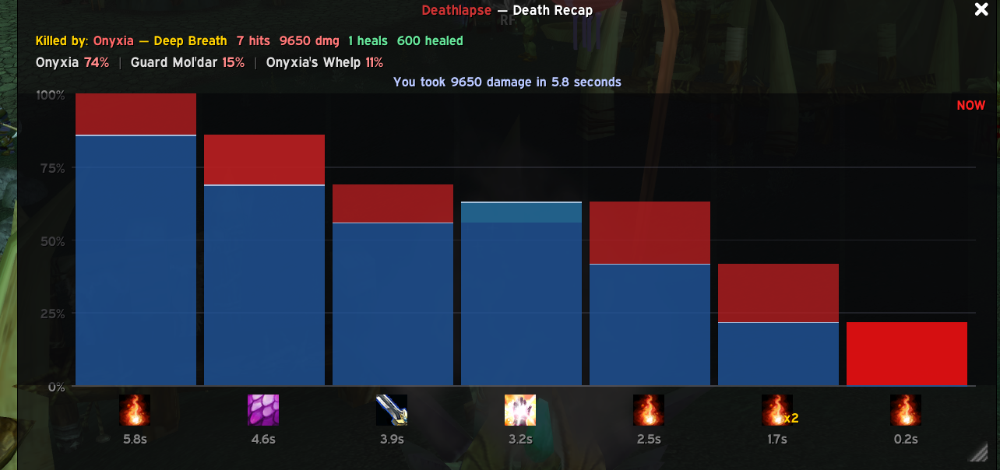

  

# Deathlapse

A death-recap timeline for WoW TBC Anniversary Classic.

When you die, a waterfall chart appears showing the meaningful final stretch of damage and healing before it happened, up to 20 seconds. If the addon can tell you were recently topped off, it clips older noise and starts from that full-health point. Hover any column to see the source, spell, amount, and timing. The panel hides automatically when you're alive again.

The entire addon lives on the minimap. A small skull button orbits it; click it to toggle the panel or drag it to reposition. A red dot appears on the button when death data is available. The recap frame can be moved and resized from the lower-right grip; ElvUI users get the ElvUI frame skin when available.

Current version: `1.1.4`

  

## What the Timeline Shows

- **Blue columns** — reconstructed HP remaining after each event.
- **Red caps** — damage taken. Overkill events are brighter red.
- **Green caps** — healing received. Tooltips also show overheal when the combat log reports it.
- **Header** — killer name, spell used, total hits, and totals for damage and healing.
- **Clip summary** — shows how many seconds the visible death sequence spans.
- **Time labels** — seconds before death for key columns; labels thin out automatically on narrow frames.

## Install

1. Download the latest release from [GitHub](https://github.com/voc0der/Deathlapse/releases/latest) or [CurseForge](https://www.curseforge.com/wow/addons/deathlapse).
2. Extract the `Deathlapse` folder into:
   `World of Warcraft/_anniversary_/Interface/AddOns/`
3. Start the game and make sure the addon is enabled.

## Usage

The timeline appears automatically when you die. Hover bars for details. Click the minimap button to show or hide it manually.

Slash commands via `/deathlapse` or `/dl`:

| Command | Effect |
|---------|--------|
| *(no args)* | Toggle timeline |
| `show` | Show timeline |
| `hide` | Hide timeline |
| `clear` | Clear the current death record |
| `about` | Show author and GitHub repository |
| `minimap` | Toggle minimap button visibility |
| `autoshow` | Toggle auto-show on death (default: on) |
| `reset` | Reset recap position and size |
| `test` | Show a fake timeline for testing the UI |
| `help` | List commands |

## Contributing

Development and contribution notes are in [`CONTRIBUTING.md`](CONTRIBUTING.md).
Release workflow notes are in [`RELEASING.md`](RELEASING.md).

## Scope

- Target client: TBC Anniversary Classic
- TOC interface: `20505`

## Star History

  <a href="https://star-history.com/#voc0der/Deathlapse&Date">
    <picture>
      <source media="(prefers-color-scheme: dark)" srcset="https://api.star-history.com/svg?repos=voc0der/Deathlapse&type=Date&theme=dark" />
      <source media="(prefers-color-scheme: light)" srcset="https://api.star-history.com/svg?repos=voc0der/Deathlapse&type=Date" />
      
    </picture>
  </a>

